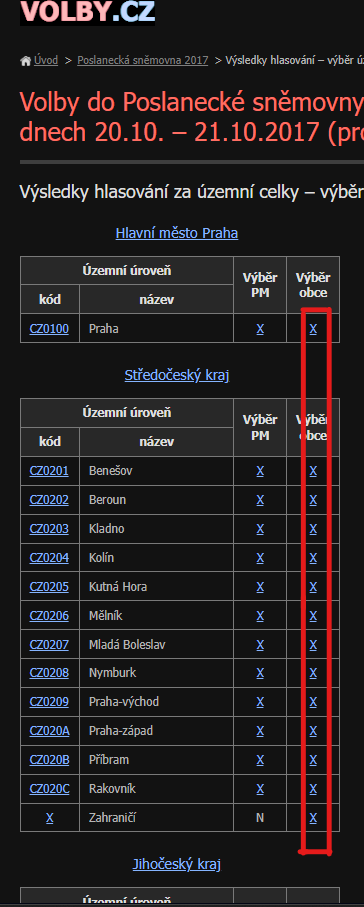

<!-- PROJECT SHIELDS -->
<!--
*** This template uses markdown "reference style" links for readability.
*** Reference links are enclosed in brackets [ ] instead of parentheses ( ).
*** See the bottom of this document for the declaration of the reference variables
*** for contributors-url, forks-url, etc. This is an optional, concise syntax you may use.
*** https://www.markdownguide.org/basic-syntax/#reference-style-links
-->


<!-- ABOUT THE PROJECT -->
## About The Webscrap Project


This project was created for **Engeto Academy** as a ticket to the next level of code life.

### Built With

* 💻 Sublime Text 3
* ☕ Lot of Patience and Coffee

<!-- GETTING STARTED -->
## Getting Started

To get a local copy up and running follow these simple steps.

### Prerequisites

* Python
You need to install python for this to work. If you don't have python click this link to download it:
[python.org](https://www.python.org)

* Git
```sh
sudo apt-get install git
```

### Installation
 
1. Clone the repo
```sh
git clone https://github.com/Gioth8281/engeto_test3.git
```
2. Navigate to the engeto_test3 folder
3. Open a command prompt in the folder and execute the following command
```sh
pip install -r requirements.txt
```


<!-- USAGE EXAMPLES -->
## Usage

1. Click on the following link: [volby.cz](https://volby.cz/pls/ps2017nss/ps3?xjazyk=CZ)
2. Click on any city with "X", see image.



4. Copy the link
5. Execute the following command in the folder
```sh
python main.py "copied link" file_name.csv
```

<!-- CONTACT -->
## Contact

_Discord_ - tsys
